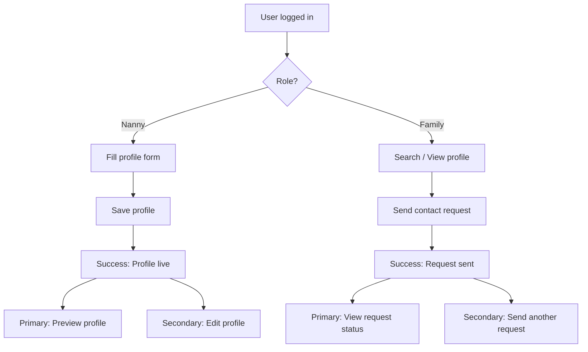

# Success Page Ideas + Flow

## Goals
- Confirm completion with clarity and relief.
- Offer the next best step with a single primary action.
- Keep it simple and consistent with the MVP style.

## Success Page Ideas

### Nanny (Profile Created / Updated)
- Title: "Profile live"
- Subtitle: "Families can now find you by city or zip."
- Key summary: Name, city, availability, rate
- Primary action: "Preview profile"
- Secondary action: "Edit profile"
- Optional info: "Tips to improve visibility" (short checklist)

### Family (Contact Request Sent)
- Title: "Request sent"
- Subtitle: "You’ll be notified when the nanny responds."
- Key summary: Nanny name + city
- Primary action: "View request status"
- Secondary action: "Send another request"
- Optional info: "What happens next" (3-step mini timeline)

## Flow Diagram (Mermaid)

